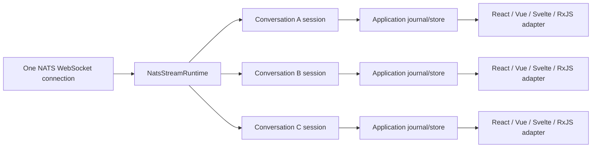

# NATSail architecture proposal

Status: historical proposal. See the [README](../../README.md) for the implemented interface and current limits.

Implemented operability note: the runtime now keeps low-frequency lifecycle diagnostics in `runtime.events` and sends counters, gauges, and durations through one optional dependency-free synchronous telemetry sink. Core and adapter packages share the reporter through the existing runtime-adapter seam. Default measurement dimensions deliberately omit application identifiers and NATS routing/configuration names; an optional package maps the events to OpenTelemetry without making OpenTelemetry a Core dependency. A local JSON benchmark establishes comparable 1,000/5,000 replay and configurable live-burst scenarios; it is not a server-throughput claim.

## Decision in one paragraph

Build a small, NATS-first and framework-neutral resumable-consumption layer, then add WebSocket, React, and TanStack adapters only after the direct nats.js path is proven. Do not replace nats.js reconnection or ordered consumers. Use them as the in-session recovery engine, while the new layer owns the contract nats.js intentionally does not own: opaque cursors, replay strictly after a cursor, checkpoint timing, duplicate and retention-gap behavior, bounded retries, and status/telemetry. Keep RxJS and Caspian event transformation in application adapters. A later TanStack AI `StreamDurability` adapter backed by JetStream would be an externally legible integration, not part of the version 0.1 core.

The implemented project name is NATSail. The package scope is `@natsail`.

## Why this is a layer, not another NATS client

NATS already supplies the hard storage and transport primitives:

- JetStream stores the ordered log and assigns a stream sequence.
- Ordered consumers are ephemeral, acknowledgement-free, single-threaded consumers that recreate themselves when they detect a delivery gap.
- Durable consumers persist acknowledgement state on the server and can recover from client or server failure.
- Pull consumers are the NATS recommendation when flow control, scalability, or detailed error handling matter.
- nats.js reconnects the underlying connection and exposes connection and consumer status notifications.

The missing abstraction is application delivery. A UI or gateway still has to decide what a cursor means, when it is safe to advance it, how a new process starts from it, what happens when retention has removed part of the range, and how a caller distinguishes replaying from live delivery.

TanStack AI is reference material, not the foundation or a required integration. It makes several useful delivery rules unusually clear: persist before delivery, use opaque offsets, replay strictly after the supplied offset, and keep durable delivery distinct from persisted application state. The NATS runtime should apply those lessons directly to JetStream without adopting TanStack's AI-run model or duplicating records into another log. The later private compatibility example proved a live TanStack AI subscribe/send adapter and a separate AI SDK transport without changing the runtime; durable mapping remains future work.

Primary references:

- [NATS consumer concepts](https://github.com/nats-io/nats.docs/blob/98856081c8843d9fa238b3ea96e1f72d07f31113/nats-concepts/jetstream/consumers.md)
- [nats.js ordered-consumer implementation](https://github.com/nats-io/nats.js/blob/3a7b736b175d9a387130210c88f851d71e1b014f/jetstream/src/consumer.ts)
- [TanStack AI resumable WebSockets](https://github.com/TanStack/ai/blob/f7c67a85bb7dabaed4c80fc01ffc8a03fe9375a0/docs/resumable-streams/websockets.md)
- [TanStack AI durability contract](https://github.com/TanStack/ai/blob/f7c67a85bb7dabaed4c80fc01ffc8a03fe9375a0/packages/ai/src/stream-durability.ts)

## Requirements inferred from production application patterns

The module needs to serve three callers:

1. A browser connected directly to NATS over WebSockets.
2. An application-owned WebSocket or SSE gateway that hides NATS credentials and subjects.
3. React features that want one decoded, shared event feed with a simple lifecycle.

The key operations are deliberately small:

- Open a logical stream from the beginning, from now, or strictly after a cursor.
- Deliver typed records in order and checkpoint a record only after the caller accepts it.
- Surface connection, replay/live transition, retry, gap, cancellation, and terminal state.
- Resume after a transport drop without rebuilding the producer or replaying accepted records.
- Detect and report when retention makes a requested cursor impossible to satisfy.
- Fan out locally without creating one JetStream consumer per React projection.

Important constraints:

- Delivery is at-least-once. Exactly-once side effects require an idempotency key or transactional application store.
- A cursor can only restore delivery position. It cannot restore React state. After a full reload, a caller must either replay from the beginning or restore a materialized snapshot and its cursor atomically.
- Stream sequence numbers can jump when a consumer filters a shared stream. A jump is not automatically a gap.
- A browser or gateway must not be allowed to turn an untrusted URL parameter into an arbitrary NATS stream or subject.
- Authentication refresh is a connection-provider responsibility, while the resumable stream reports auth failure and waits for a usable connection.

## The external seam: one runtime, many logical streams

The deep module should be a NATS application streaming runtime. It owns one caller-supplied `NatsConnection` (or connection factory), supervises many logical JetStream feeds over it, and exposes a small framework-neutral interface. NATS already multiplexes subscriptions and JetStream pull requests over one connection, so opening five conversations inside one page must not create five WebSocket connections.



The runtime's interface should be callback-first so “handler completed” is the unambiguous checkpoint seam. Framework adapters can place a store, signal, observable, or hook after that seam.

```ts
type StreamPriority = 'foreground' | 'background' | 'paused'

interface StreamDefinition<T, P> {
  stream: string
  subject(params: P): string
  decode(message: JsMsg): T
  identity?(value: T): string
  sequence?(value: T): number | undefined
}

interface StreamLease {
  readonly status: AsyncIterable<StreamStatus>
  setPriority(priority: StreamPriority): void
  close(): Promise<void>
}

interface NatsStreamRuntime {
  consume<T, P>(
    definition: StreamDefinition<T, P>,
    params: P,
    options: {
      start: 'all' | 'new'
      priority?: StreamPriority
      checkpoint?: CheckpointStore
      signal?: AbortSignal
    },
    accept: (delivery: Delivery<T>) => void | Promise<void>
  ): StreamLease
  close(): Promise<void>
}

declare function createNatsStreamRuntime(options: {
  connection: () => Promise<NatsConnection>
  limits?: RuntimeLimits
  observe?: (event: RuntimeEvent) => void
}): NatsStreamRuntime
```

The runtime advances its in-memory or injected checkpoint only after `accept` resolves. A React adapter's `accept` writes to an external store and batches notifications; an RxJS adapter's `accept` publishes into a subject; a Node caller can update a database. None of those packages belong in core.

This seam earns its depth by hiding connection replacement, ordered-consumer creation, replay/live state, retry classification, bounded pulls, status draining, sequence/cursor validation, session scheduling, and cleanup. Deleting it would force those responsibilities back into every hook and framework adapter.

## Multi-conversation efficiency model

There are two different “many tabs” cases and they need different answers.

### Many conversation views inside one page

A well-structured application mounts one NATS provider at its root, so logical views within that page share one `NatsConnection`. Different feeds still create different ordered consumers and replay loops. The expensive part is usually not another WebSocket: it is replaying, decoding, reducing, retaining, and rendering each feed's history.

The runtime should therefore multiplex the connection but keep a consumer per independently resumable logical feed. Combining unrelated conversations into one wildcard consumer would reduce consumer count at the cost of receiving unwanted traffic, coupling cursors and lifecycle, complicating tenancy, and making one slow conversation affect the others.

Each logical session has a priority-managed lifecycle:

- `foreground`: visible and latency-sensitive; consume live events immediately.
- `background`: keep up at lower priority while capacity allows, without forcing UI renders for every event.
- `paused`: stop and delete the ephemeral consumer, retain the last accepted cursor and the caller's in-memory/materialized state, and recreate from `cursor + 1` when activated.

The runtime should apply connection-wide limits rather than letting every hook independently pull as fast as possible:

- cap concurrent history replays;
- bound each session's queue and the total buffered messages/bytes;
- prioritize live foreground traffic over background replay;
- use fair scheduling so one long history cannot monopolize the browser event loop;
- lazily open hidden conversations and hibernate least-recently-used background sessions when the budget is reached;
- report replay count, lag, queue depth, hibernation, consumer recreation, and handler duration.

Core must never accumulate an entire conversation. It emits a bounded stream of deliveries. A framework adapter can batch store notifications per animation frame or time slice, and the UI can virtualize long message lists. For genuinely large histories, the scalable solution is an authoritative snapshot or local event journal paired atomically with its cursor, followed by JetStream catch-up—not a larger `shareReplay` buffer.

### Multiple real browser tabs or windows

Each browser tab is a separate JavaScript realm. With the current root provider, each tab creates its own NATS WebSocket and its own consumers. That is a reasonable fallback for modest usage, but opening many tabs duplicates connections, replays, memory, and server consumers.

The framework-neutral runtime enables an optional cross-tab host without changing stream definitions:

- A `SharedWorker` adapter can own one runtime and one NATS connection for the origin, multiplex logical feeds over `MessagePort`s, and share a feed when two tabs open the same conversation.
- A window-local adapter remains the fallback when a shared worker is unavailable or inappropriate.
- `BroadcastChannel` leader election can be explored as a fallback, but it is more failure-prone and should not be core version 0.1 behavior.
- A service worker should not be assumed to own a permanently live socket because its lifecycle is controlled by the browser.

Cross-tab sharing is a real second adapter at the runtime seam, unlike a hypothetical generic transport abstraction. It should be built after the window-local runtime is proven under fault and load tests.

## Application patterns that motivated extraction

There are three overlapping NATS paths today.

### Caspian canonical events

`createJetStreamObservable` creates an ordered pull consumer and `CaspianEventStreamService` shares it with RxJS. The nats.js consumer holds the last delivered stream sequence in memory and recreates its ephemeral consumer from `last stream sequence + 1` when its delivery sequence is inconsistent. This is the right primitive for a transient disconnect while the `Consumer` object remains alive.

The application adds fatal-error rebuild timers and event-ID de-duplication. A full rebuild starts with `DeliverPolicy.All`, because the JetStream sequence is discarded when `JsMsg` is parsed into `CaspianEvent`. That is safe but increasingly expensive for long conversations.

`shareReplay({ bufferSize: 100, refCount: true })` fans out the canonical stream. The buffer is not a conversation store. A late projection can only receive the bounded replay plus new events, so a projection that needs all history must keep its own event journal or load a snapshot.

### Legacy environment and deployment processors

`JetStreamService` creates named push consumers with `AckPolicy.Explicit`, but passes a Core NATS `Msg` to callbacks. The four processors using it do not acknowledge messages. NATS therefore redelivers after `AckWait` and eventually stops delivery at `MaxAckPending` or `MaxDeliver`. Their fallback is a Core NATS subscription, which silently changes the reliability contract from stored/replayable to ephemeral and is not retained for cleanup.

This path should migrate to the same pull-based source before extraction.

### Ephemeral display streams

Token deltas and canvas synchronization use Core NATS subscriptions. Token deltas are explicitly display-only: the canonical assistant response still arrives through JetStream. That is a sound use of ephemeral delivery and should remain available as an explicitly lossy mode, not be disguised as resumable.

## Immediate correctness findings

1. `inactive_threshold` is easy to pass with mixed units. A raw `ConsumerConfig` nanosecond value passed into nats.js `OrderedConsumerOptions` is treated as milliseconds and converted again. A new interface must use unit-bearing names such as `inactiveThresholdMs` and perform the conversion internally.
2. The push-consumer processors request explicit acknowledgement but never acknowledge. This can cause duplicate reducer actions, backpressure stalls, and orphaned consumers.
3. The ordered cursor never reaches application records. `parseJetStreamEvent` returns only the domain event, so a fatal rebuild cannot resume from the last accepted JetStream sequence.
4. nats.js advances its ordered in-memory cursor before the message reaches RxJS or the React reducer. That cursor means “delivered by nats.js,” not “successfully applied by the application.”
5. A numeric sequence alone is ambiguous after a stream is deleted and recreated. A persisted cursor must also bind to the stream epoch (`StreamInfo.created`) and logical filter.
6. Retry policy is distributed across `NatsProvider`, `JetStreamProvider`, `useConversation`, `useConversationFlow`, `useConversationTail`, and nats.js itself. Status is observable, but ownership is not singular.
7. There is no integration suite that drops a connection, deletes a consumer, advances stream retention, or verifies an exact delivered sequence.

nats.js 3.4 adds consumer reset support for NATS server 2.14 and later. That may help a future gateway reconcile a durable consumer to a client checkpoint, but the first release should preserve a clear compatibility policy: ordered ephemeral consumers plus an application checkpoint remain the baseline.

## Three deliberately different interface designs

### Design A: one deep NATS runtime (recommended)

This is the external seam described above: one runtime owns connection-wide limits and many callback-first consumption leases.

```ts
const runtime = createNatsStreamRuntime({
  connection: getNats,
  limits: {
    maxConcurrentReplays: 2,
    maxBufferedPerStream: 64,
    maxBufferedTotal: 512,
  },
})

const lease = runtime.consume(
  conversationEvents,
  { organizationId, workspaceId },
  { start: 'all', priority: 'foreground', checkpoint },
  async (delivery) => {
    await conversationJournal.accept(delivery)
  }
)

lease.setPriority('background')
await lease.close()
```

It hides consumer construction/recreation, `DeliverPolicy`, duration conversion, status draining, cursor validation, monotonic checkpoint writes, replay/live scheduling, aggregate backpressure, and cleanup. Its interface is NATS-specific enough to retain strong JetStream guarantees, while its callback seam is neutral to React, RxJS, Vue, Svelte, workers, and Node.

Its main tradeoff is ownership: the caller needs one application ingestion store or handler per logical feed. That is intentional. Multiple UI projections should subscribe to the accepted local state rather than each independently controlling a NATS cursor.

### Design B: a capability-rich follow/log protocol

This design treats JetStream as one implementation of a general append-only durability backend, close to TanStack AI's contract. Its more flexible variant returns a `FollowLease` with explicit `grant(credit)`, `checkpoint(cursor)`, `cancel()`, and `closed` operations; that shape can multiplex direct NATS, WebSocket, and SSE sources behind one client.

```ts
interface ResumableLog<T, TCursor extends string = string> {
  append(values: readonly T[]): Promise<readonly TCursor[]>
  read(options: {
    after: TCursor | 'start' | 'now'
    signal?: AbortSignal
  }): AsyncIterable<{ cursor: TCursor; value: T }>
  snapshot(): Promise<readonly { cursor: TCursor; value: T }[]>
  close(): Promise<void>
}

declare function jetStreamLog<T>(options: {
  connection: NatsConnection | (() => Promise<NatsConnection>)
  stream: string
  subjectFor(logId: string): string
  codec: Codec<T>
  retention: RetentionContract
}): (logId: string) => ResumableLog<T>
```

The same substrate can power generic server streams and a TanStack adapter:

```ts
const durability: StreamDurability<JetStreamOffset> = tanStackJetStreamDurability(request, {
  connection: getNats,
  stream: 'AI_RUNS',
  subjectPrefix: 'ai.runs',
})
```

It hides per-log subject encoding, publish acknowledgements, per-entry offsets, close markers, bounded point-in-time snapshots, tailing readers, retention-gap checks, and leases/reapers for abandoned producers.

Its strength is transport independence, explicit downstream credit, and a clean open-source integration story. Its cost is a larger contract than most applications need for consuming an existing event stream; publishing, terminalization, command cancellation, and generic transport policy are irrelevant to many NATS subscribers.

### Design C: a React-first channel

This design optimizes a common React caller and makes the library feel like TanStack Query.

```ts
const channel = defineJetStreamChannel({
  key: ({ orgId, workspaceId }) => ['conversation', orgId, workspaceId],
  stream: 'CASPIAN_EVENTS',
  subject: ({ orgId, workspaceId }) => `caspian.events.${orgId}.${workspaceId}`,
  decode: parseJetStreamEvent,
  initial: () => createConversationView(),
  reduce: reduceConversationEvent,
})

function Conversation({ orgId, workspaceId }: Props) {
  const { data, status, error, replay } = useJetStreamChannel(channel, {
    orgId,
    workspaceId,
  })
  // render data
}
```

It hides the connection provider, a single shared consumer, projection fan-out, retry timers, event-ID de-duplication, cursor/state persistence, React subscription cleanup, and replay/live UI state.

Its strength is ease of correct use inside this app. Its weakness is that it bakes projection and framework policy into the foundation, making it less useful to Node gateways, Vue/Svelte applications, and upstream NATS users.

## Comparison and synthesis

Design A has the deepest interface: one runtime concentrates NATS lifecycle and connection-wide resource policy while its callback seam composes with any framework. It is the best foundation.

Design B is the most general and is the natural shape for a TanStack AI or multiplexed-gateway adapter. It should not define the first release; otherwise a read-only consumer is forced to understand producer terminalization, snapshots, credits, and transport commands.

Design C offers the best first-use experience but is shallow if it owns the NATS mechanics itself. It should be a React adapter over Design A, with domain-specific reducers remaining in the application.

The synthesis is therefore intentionally staged:

- Version 0.1: `@scope/nats-stream-runtime`, containing Design A's NATS-specific runtime, window-local host, and direct nats.js implementation.
- First adapters: RxJS and React bridges exercised by realistic reference usage before release.
- Later: a `SharedWorker` host that multiplexes one runtime across real browser tabs.
- Optional later: a gateway WebSocket/SSE adapter using the same cursor/envelope rules.
- Later: `@scope/tanstack-ai-jetstream`, implementing Design B on proven JetStream log primitives.

RxJS and React should never be core dependencies. A transport-neutral interface should be extracted only after a second real transport exists.

## Cursor and delivery semantics

An offset should be opaque on the wire and self-validating inside the adapter. A versioned payload should bind at least:

- stream identity;
- filter or logical channel identity;
- JetStream stream sequence;
- optional logical-entry ordinal;
- schema version and integrity tag.

The logical ordinal matters for per-subject retention. With a filtered shared stream, global stream sequences legitimately jump because unrelated subjects occupy the intervening positions. If older entries for one subject are removed while the stream's global first sequence remains lower, stream sequence alone cannot prove that no matching entry disappeared. Logs created by the library should therefore write a per-log ordinal in the record envelope and require `next ordinal = previous ordinal + 1`.

For existing streams that do not carry such an ordinal, gap detection is best-effort:

- fail if the requested stream sequence is older than the stream's global first sequence;
- do not treat a jump between filtered records as a gap;
- allow the caller to supply a domain `sequenceOf(value)` validator when available;
- expose a `gap` result rather than silently falling back to `all` or `new`.

Checkpoint order is part of the API contract:

1. Receive and validate a record.
2. Apply it idempotently or persist it with application state.
3. Advance the checkpoint monotonically.
4. Only then release more capacity or acknowledge upstream.

If a process dies between steps 2 and 3, one duplicate is valid. If it checkpoints before step 2, data loss is possible. The library must prefer duplicates over loss.

## Optional application WebSocket protocol

This protocol is not part of the core runtime. If an application chooses an application-owned gateway instead of direct NATS WebSockets, the adapter should use a small protocol independent of React and TanStack AI:

```ts
type ClientFrame =
  | { type: 'open'; channel: string; cursor?: string; requestId: string }
  | { type: 'checkpoint'; requestId: string; cursor: string }
  | { type: 'cancel'; requestId: string }
  | { type: 'pong' }

type ServerFrame<T> =
  | { type: 'data'; requestId: string; cursor: string; value: T }
  | { type: 'ready'; requestId: string; phase: 'replaying' | 'live' }
  | { type: 'checkpointed'; requestId: string; cursor: string }
  | { type: 'gap'; requestId: string; requested: string; availableFrom?: string }
  | { type: 'error'; requestId: string; code: string; retryable: boolean }
  | { type: 'ping' }
```

Borrow from TanStack AI:

- One persistent conversation/channel socket can carry multiple logical streams.
- A reconnect sends the last accepted opaque cursor.
- Replay is read-only; it must not restart the producer or repeat side effects.
- Heartbeats, idle timeout, abort, and consecutive no-progress retry limits are explicit.
- Forward progress resets the reconnect-attempt counter.
- Durable delivery and application persistence are separate concepts.

Do not copy blindly:

- TanStack's durability is per AI run; a NATS channel may be long-lived and non-terminal.
- A JetStream record is already persisted before delivery, so a gateway should not duplicate it into a second durability log.
- NATS stream sequences are filter-sensitive global positions, not contiguous per-channel offsets.
- Direct nats.js-over-WebSocket clients already use the NATS protocol and its reconnect loop; they do not need the application WebSocket framing.

The server must resolve `channel` to an authorized stream/filter mapping. It must never accept raw stream or subject values from a browser frame.

## Package implementation boundaries

Core should own:

- a session registry over one shared NATS connection;
- connection-wide replay, buffer, and active-session budgets;
- priority and fair scheduling across logical streams;
- cursor codec and validation;
- ordered-consumer creation from semantic start modes;
- in-session recreation and new-process resume;
- checkpoint-store interface;
- retry state machine and typed errors;
- gap checks and status events;
- cancellation, backpressure, and cleanup;
- test fixtures that can deliberately interrupt connections and consumers.

Adapters should own:

- nats.js connection acquisition and auth refresh;
- window-local and `SharedWorker` hosting;
- WebSocket/SSE framing;
- RxJS conversion and local fan-out;
- React external-store integration;
- TanStack AI `StreamDurability` mapping.

Applications should retain:

- subject authorization and organization/workspace mapping;
- Caspian decoding and validation;
- event-ID and domain-sequence idempotency;
- conversation/graph reducers;
- token-stream fallback and canonical-message reconciliation;
- application snapshots and IndexedDB/server persistence decisions.

## Incremental migration for an existing application

### Phase 0: make the current behavior testable

- Add a NATS integration harness and pin a server-version matrix.
- Correct the ordered `inactive_threshold` unit mismatch.
- Add acknowledgement or replace the legacy push-consumer service.
- Preserve JetStream metadata beside each parsed Caspian event.
- Instrument consumer count, recreate count, last delivered sequence, retry count, lag, and gap errors.

### Phase 1: introduce the runtime internally

- Implement Design A under an internal package boundary with no React or Caspian imports.
- Migrate `CaspianEventStreamService` first and keep its existing observable API through an adapter.
- Replace hook-owned fatal retry timers with one runtime-owned retry state machine.
- Keep Core NATS token streams explicitly ephemeral.

### Phase 2: unify consumers

- Move environment, capability, bootstrap, and package processors from push consumers to the same runtime.
- Create one consumer per logical channel and fan out locally.
- Replace `shareReplay(100)` as historical storage with an explicit event journal or an authoritative snapshot plus cursor.
- Add foreground/background/paused priorities and prove that inactive conversation views hibernate and resume without a full replay.
- Benchmark 1, 4, 8, and 16 simultaneous conversations before choosing default runtime limits.

### Phase 3: extract and publish

- Remove application-specific names and publish the NATS-specific core first.
- Run examples against NATS server 2.10/2.12/2.14 and nats.js 3.3/3.4 where supported.
- Publish direct-browser and Node-process examples with deterministic disconnect and retention failures.
- Incubate the React, RxJS, `SharedWorker`, gateway, and TanStack adapters separately; publish each only after its interface is exercised in a real application.
- Take the narrowest useful improvements upstream to nats.js: examples, public status/cursor affordances if required, and documentation clarifying ordered-option duration units.

### Phase 4: choose the production cross-tab topology

Implemented: `@natsail/browser-broker` now provides the SharedWorker option through the existing `SessionSource` contract, with protocol-v1 validation, immutable tenant/auth identity, credential refresh, bounded per-tab queues, cursor acknowledgements, explicit lag, heartbeat cleanup, and tab-local fallback policy.

- Retain direct NATS WebSockets when low latency and existing NATS ACL/token infrastructure are the priority.
- Add a `SharedWorker` host when reducing duplicate same-origin browser-tab connections and consumers is worth the additional lifecycle work.
- Add the gateway adapter when credentials, tenancy authorization, or protocol portability should be server-owned.
- Keep every host behind the same runtime interface so topology does not leak into framework adapters.

## Verification matrix

The open-source release should not claim reliability until these tests pass against a real NATS server:

- Disconnect during initial replay and during live delivery.
- Delete the ordered consumer while it is active.
- Restart the NATS server and perform a JetStream leader change.
- Deliver a record, kill the client before checkpoint, and verify one safe duplicate.
- Checkpoint a record, reconnect, and verify delivery starts strictly after it.
- Interleave unrelated subjects and verify stream-sequence jumps do not create false gaps.
- Truncate retention before the cursor and verify a typed gap instead of silent skipping.
- Expire credentials during reconnect and recover through the connection provider.
- Slow the handler until backpressure engages without unbounded memory growth.
- Subscribe multiple local projections and verify only one server consumer exists.
- Open two tabs under each supported checkpoint-store policy.
- Cancel and remount repeatedly and verify no consumer or status-iterator leak.
- Reject malformed, cross-stream, cross-channel, and unauthorized cursors.
- Replay a long conversation and verify every projection receives the complete required history.
- Open 1, 4, 8, and 16 conversations inside one page and verify there is exactly one NATS connection per runtime.
- Replay several large histories concurrently and verify foreground live traffic remains responsive and replay scheduling is fair.
- Exceed the session budget and verify background sessions hibernate, release their consumers, and resume from the last accepted cursor.
- Enforce per-session and aggregate byte/message budgets and verify a slow handler cannot grow memory without bound.
- When the optional shared-worker host exists, open multiple real browser tabs and verify one connection, shared same-conversation feeds, tab crash cleanup, and worker restart recovery.

Property tests should assert monotonic cursors, no delivery below the committed cursor, no silent gap, and `delivered IDs = published IDs` after de-duplication under arbitrary disconnect/checkpoint schedules.

## Open-source path

Start outside the official NATS scope with an Apache-2.0 license to align with nats.js, a small RFC, and executable failure-injection examples. Ask NATS maintainers for design feedback before promising an upstream package. The first upstream contribution should likely be documentation and focused nats.js affordances, not a large wrapper PR.

The implemented TanStack AI subscribe/send adapter is an optional live-transport compatibility example. A future durability adapter remains useful because TanStack AI's durability contract is precise and its failure semantics are documented. Neither should shape the runtime: application event feeds can be long-lived NATS channels, not AI-run logs.

Success for version 0.1 is deliberately narrow: one runtime multiplexing a shared NATS connection, ordered pull sessions, one cursor format, one checkpoint-store contract, priority-aware bounded scheduling, typed gap/retry status, and tests demonstrating no loss across reconnects. Framework and transport integrations can follow without changing that interface.

## Additional primary sources

- [NATS JavaScript consumer guide](https://github.com/nats-io/nats.docs/blob/98856081c8843d9fa238b3ea96e1f72d07f31113/using-nats/developing-with-nats/js/consumers.md)
- [nats.js ordered-consumer tests](https://github.com/nats-io/nats.js/blob/3a7b736b175d9a387130210c88f851d71e1b014f/jetstream/tests/consumers_ordered_test.ts)
- [nats.js 3.4.0 release](https://github.com/nats-io/nats.js/releases/tag/v3.4.0)
- [TanStack AI resumable-stream overview](https://github.com/TanStack/ai/blob/f7c67a85bb7dabaed4c80fc01ffc8a03fe9375a0/docs/resumable-streams/overview.md)
- [TanStack AI advanced resumability semantics](https://github.com/TanStack/ai/blob/f7c67a85bb7dabaed4c80fc01ffc8a03fe9375a0/docs/resumable-streams/advanced.md)
- [TanStack AI custom durability adapters](https://github.com/TanStack/ai/blob/f7c67a85bb7dabaed4c80fc01ffc8a03fe9375a0/docs/resumable-streams/custom-adapter.md)
