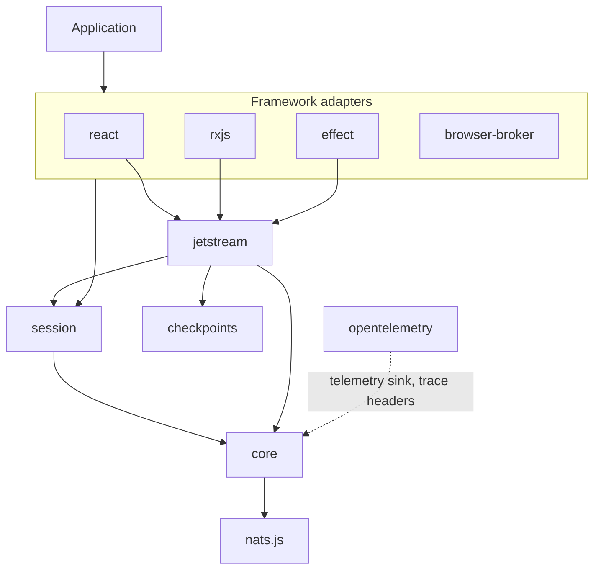
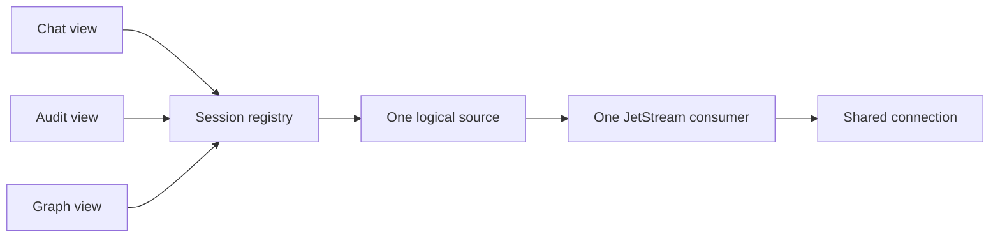
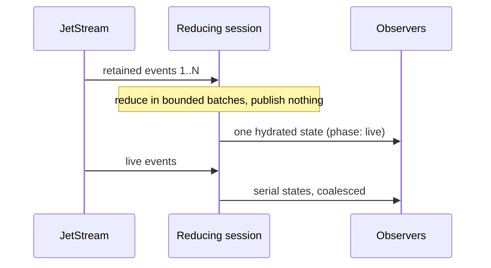

# NATSail architecture

How the packages fit together and who owns what. For delivery guarantees and failure behavior, see the [delivery model](../DELIVERY.md). For deployment tuning, see the [production guide](../PRODUCTION.md). For unfinished work, see [project status](../STATUS.md). For the original problem analysis, see the [research notes](../research/nats-resumable-streams.md).

## Design goals

NATSail keeps NATS reliability and ownership policy out of application components. It wraps nats.js; it does not replace it.

1. One application runtime owns one shared NATS connection.
2. A logical session has one validated delivery contract and any number of local observers.
3. JetStream replay finishes before a reducing session publishes its first state.
4. Delivery, buffering, retries, and cleanup each have an owner and a limit.
5. The application keeps its reducers, authorization, and persistence.

## Package layers



Each package declares its internal dependencies in `package.json`. Core imports none of the others.

| Package                  | Owns                                                                                                                                                                      |
| ------------------------ | ------------------------------------------------------------------------------------------------------------------------------------------------------------------------- |
| `@natsail/core`          | The connection, Core subscribe/publish/request, codecs, limits, diagnostics, telemetry sink, `NatsailBatchPolicy` and the batcher.                                        |
| `@natsail/jetstream`     | Ordered consumption, replay boundary, cursors, recovery, duplicate and retention policy, reducing sessions, explicit-ack processors and their controller.                   |
| `@natsail/session`       | `SessionRegistry`: keyed, reference-counted logical sources, plus `closeNatsResources`.                                                                                   |
| `@natsail/checkpoints`   | Monotonic cursor stores: in memory and IndexedDB.                                                                                                                         |
| `react`, `rxjs`, `effect` | Adapters to each framework's lifecycle over the same runtime and session definitions. They add no transport model.                                                         |
| `@natsail/browser-broker` | Same-origin tab sharing: a SharedWorker host that runs `SessionSource` leases for many tabs.                                                                              |
| `@natsail/opentelemetry` | A metrics sink for core's telemetry events, and `injectTraceContext` / `extractTraceContext` for NATS headers. The only package with an OpenTelemetry peer dependency.      |

The application owns subject selection and authorization, payload validation, domain reducers, idempotency of external side effects, and any durable materialized view.

## Runtime and connection ownership

`createNatsRuntime()` takes an official nats.js connect function (or `{ create({ signal, attempt, attemptId }) }`) and resolves it lazily into one cached connection.

```ts
const runtime = createNatsRuntime({
  connect: () => connect({ servers }),
  initialConnectRetry: { maxAttempts: 3, delayMs: 500 },
  connectionRecovery: { onPermanentClose: 'restart' }, // or 'wait'
  shutdownTimeoutMs: 30_000,
  maxBufferedEvents: 256,
  limits: { maxJetStreamConsumers: 32, maxBufferedMessages: 2_048 },
})
```

Connection lifecycle:

- nats.js handles ordinary transport reconnects.
- After a permanent close, the runtime opens a new connection immediately (`restart`, the default) or on the next caller (`wait`). Each connection has a generation number, reported by `runtime.inspect().connectionGeneration` and in diagnostic details.
- `runtime.reconnect()` forces re-authentication on a live connection or replaces a closed one. Concurrent callers share one operation.
- `runtime.connection()` returns the runtime-owned nats.js connection for operations NATSail does not wrap. Do not close or drain it.

`runtime.events` is a low-volume stream of status and diagnostic events. Each iterator keeps at most `maxBufferedEvents`; a slow reader loses the oldest and receives an `event-buffer-overflow` diagnostic. `inspect()` returns a point-in-time view: connection, generation, active resources, and used versus configured limits. High-frequency measurements go to the optional `telemetry` sink instead.

### Shutdown

`runtime.close()` drains managed Core subscriptions, lets JetStream processors finish their active handler, then drains the connection. The whole sequence shares `shutdownTimeoutMs`. On expiry the runtime aborts each handler's `signal`, force-closes the connection, and rejects with `NatsRuntimeShutdownTimeoutError`. Cleanup failures reject with `AggregateError`.

A runtime and its session registry have separate lifetimes. `closeNatsResources({ runtime, sessions })` starts both closes at once, and the runtime owns the deadline. React's `NatsManagedProvider` and Effect's `Natsail.layerScoped` call it for you.

### Limits

`limits` caps the aggregate of active JetStream consumers (ordered consumers and processors) and nats.js pull-buffer messages or bytes. A resource reserves its share before it opens and releases it on close. Exceeding a limit throws `NatsRuntimeLimitError`.

Adapter packages join the runtime through the `NATS_RUNTIME_ADAPTER` symbol: `manage()` registers a closable resource with an allocation, and the same reporter carries diagnostics and telemetry.

## Core NATS and JetStream are different contracts

Core subscriptions are live and ephemeral. Use them for presence, token deltas, and anything with a separate canonical record. Handlers run serially and receive `{ signal }` as a third argument.

JetStream adds stored delivery in two modes that solve different problems.

### Ordered consumption

`consumeJetStream()` runs one ordered pull consumer with `AckPolicy.None`. Each delivery carries its stream cursor, `replay: 'initial' | 'live'` (classified against the backlog captured at open), and optional `headers`. `caughtUp` resolves when that backlog is consumed. Messages that arrive during replay do not move the boundary.

Recovery follows the last cursor the application accepted, not server acknowledgement state. With a `resume` store, a new lease starts strictly after the last checkpoint that a handler committed. A handler failure does not advance it.

A checkpoint binds stream name, stream epoch (so a recreated stream is detected), sequence, and a scope made from the normalized filter plus an optional `resume.scope`. A mismatch raises `JetStreamResumeError` (`checkpoint-stream-mismatch`, `checkpoint-epoch-mismatch`, `checkpoint-scope-mismatch`).

Checkpoint order is fixed: receive, apply, then advance the cursor. A crash between apply and advance yields one duplicate. The reverse order could lose data, so NATSail never uses it.

### Explicit-ack processing

`processJetStream()` runs a named pull consumer with `AckPolicy.Explicit`. It acknowledges only after the handler succeeds. Use it for work where redelivery, `ackWaitMs`, `backoffMs`, `maxDeliver`, and `maxAckPending` are part of the contract.

Consumer ownership is `consumer: { mode, name }`:

| Mode     | Behavior                                                                                                   |
| -------- | ---------------------------------------------------------------------------------------------------------- |
| `bind`   | Attaches to an administrator-managed consumer. Inspect only; never mutates it.                             |
| `ensure` | Creates or reuses a retained consumer. Updates editable settings, rejects immutable drift.                 |
| `owned`  | Creates a durable consumer that the lease deletes on close. May recreate it on immutable drift.            |

`createJetStreamProcessorController()` administers the same consumer without a handler loop: cached `inspect()`, authoritative `refresh()`, and serialized `reconcile()`, `pause()`, `resume()`, `delete()`. `driftPolicy` (`error`, `update-editable`, `recreate-owned`) can only narrow what the mode already allows. Owned recreation resumes at a safe stream boundary and refuses deletion when none exists.

A handler returns nothing to acknowledge, `{ action: 'retry', delayMs }` to request delayed redelivery, or `{ action: 'term', reason }` to stop redelivery of that message. A thrown error stops the processor. `term` is a discard, not a dead-letter queue; see the [dead-letter recipe](../../packages/jetstream/README.md#dead-letter-recipe).

`recovery` reopens the same named consumer after an infrastructure failure and resumes from the server acknowledgement floor. Handler, decode, and configuration failures stay terminal.

### Decode failures

A payload that `codec` or `decode` rejects raises `JetStreamDecodeError` (`cause` holds the original error and the message never quotes the payload). It is terminal on every path: ordered consumers, reducing sessions (session `recovery` does not retry it), and processors by default. Only a processor can skip a bad message: `onDecodeFailure` receives the error, cursor, attempt, raw `data`, and `headers`, and returns `retry` or `term`. Ordered consumers acknowledge nothing, so they have no per-message disposition; decode defensively there.

### Delivery headers and trace context

Every JetStream delivery carries `headers` when the message has any. NATSail does not create or wrap spans in core. Propagation is explicit:

- `@natsail/opentelemetry` writes (`injectTraceContext`) and reads (`extractTraceContext`) W3C context on NATS headers through the application's registered propagator.
- `runJetStreamProcessor` in the Effect adapter runs each delivery in its own root `process <stream>` span, linked to the producer's `traceparent` header when present. `Natsail.publish` and `Natsail.request` are spans too.

## Shared logical sessions

A `SessionRegistry` turns a `SessionDefinition` (`key`, `contract`, `source`) into one local source with reference counting.



Each observer calls `acquire()` and `release()`. Observers of one definition share the source, so several React selectors or RxJS subscriptions open one consumer. `restart(key)` reopens the source and keeps the shared handle and latest value.

Sharing requires the key and the serialized `contract` to match. The contract covers every option that changes delivery: stream, filter, start, codec identity, buffer, recovery, reducer scope. Reusing a key with a different contract throws `SessionContractMismatchError`. Custom `recovery.delayMs` or `shouldRetry` functions need a stable `recovery.scope` so that two callers cannot share a key with different retry semantics.

`idleCloseMs` (default 0) keeps an unreferenced source alive briefly, which absorbs the React Strict Mode remount.

Combining unrelated conversations into one wildcard consumer would save consumers but couple cursors, tenancy, and lifecycle, and a slow conversation would stall the others. NATSail keeps one consumer per independently resumable feed and bounds the total with `limits`.

## Atomic replay and UI materialization

`defineReducingJetStreamSession()` folds ordered deliveries into application state. Replay runs the reducer for every delivery but publishes nothing until catch-up. The first state contains the whole history. Later live deliveries publish serially reduced states.



A history view therefore never renders a half-built transcript. Snapshots report `phase` (`replaying`, `reconnecting`, `live`), the last cursor, replay counts, and package restarts.

### Batching

`NatsailBatchPolicy<T>` (core) is the one bounding vocabulary: `maxItems`, `maxBytes` (with `sizeOf`), `maxWaitMs`. At least one bound is required. Normal completion flushes a partial batch; cancellation discards it; a batch already applying finishes first, and close waits for it.

Reducing sessions accept `batchPolicy`, `liveBatchMs` (16 ms default, `0` disables the time window), `scheduler`, and `workBudget`. Replay applies in bounded batches. At most one batch applies at a time, reducer calls stay serial, and the cursor or checkpoint advances only after a batch applies. `workBudget` lets a serial reducer loop yield to the host scheduler; there is no public factory for it, you pass the budget object to the option.

Each adapter applies the same policy in its own idiom:

- React: `notifications: 'immediate' | 'microtask' | 'animation-frame'` plus `batchPolicy` on `useNatsJetStreamReducerSelector` and related hooks.
- RxJS: `observeNatsJetStreamState()` with `liveBatchMs` or `batchPolicy`, and the generic `batchWithPolicy(policy)` operator.
- Effect: `materializeJetStream()` and `jetStreamStates()` reduce bounded batches, emit once at catch-up, and batch the live tail (`liveBatchWithin`, `batchPolicy`, `workBudget`).

Batching limits application and rendering work. It does not make an unbounded reducer bounded or replace list virtualization.

## Backpressure and bounded resources

| Layer                  | Bound                                                                                                            |
| ---------------------- | ---------------------------------------------------------------------------------------------------------------- |
| Runtime                | `limits`: JetStream consumers, aggregate pull-buffer messages and bytes. Event iterators: `maxBufferedEvents`.   |
| JetStream source       | One pull buffer per consumer: `maxBufferedMessages` (default 32) or `maxBufferedBytes`, never both.              |
| Processor              | `progressIntervalMs` defaults the buffer to one message. Optional `acknowledgement: { mode: 'confirmed' }`.      |
| Reducing session       | One applying batch at a time; intake backpressures behind it.                                                    |
| Effect Streams         | A bounded queue (32 by default). Core subjects `suspend` by default, or `error`, `dropping`, `sliding`. JetStream: `suspend` or `error`. State streams: `error` by default, or `dropping`, `sliding`. |
| React, RxJS            | Coalesce notifications only. They neither slow nor acknowledge the source.                                       |

These protect different resources; select them together and measure reducer, render, and handler cost under real traffic.

## Recovery model

The narrowest owner handles each failure:

1. nats.js reconnects an interrupted transport.
2. The runtime replaces a permanently closed connection.
3. A session reopens a failed ordered consumer after its last accepted in-memory cursor.
4. A checkpointed new lease resumes after its durable cursor.
5. A reducing session with no persisted state rebuilds from retained history.
6. A recovering processor resumes from the server acknowledgement floor.

Case 5 is intentional. A persisted cursor without its exact reducer state skips data, and persisted state without its cursor duplicates it, so reducing sessions reject `resume` until a store can commit both atomically.

Duplicates and retention gaps are explicit policy. A sequence at or behind the cursor is a duplicate (`duplicateDeliveryPolicy`: `drop` default, `deliver`, `error`). A checkpoint older than the stream's first sequence is a retention gap (`retentionGapPolicy`: `error` default, `continue`). NATSail never reads a jump in a filtered stream's sequence as loss, because unrelated subjects occupy the missing numbers.

## Framework ownership

- React: `NatsManagedProvider` creates the runtime and registry after commit, reuses them across Strict Mode effect replay, and closes both through `closeNatsResources` after the final unmount. `identity` change replaces the resource. `NatsProvider` accepts caller-owned objects.
- RxJS: Observables are cold and cancellable. Each subscription acquires a handle and unsubscription releases it.
- Effect: `Natsail.layer(resource)` supplies caller-owned objects; `Natsail.layerScoped(acquire)` closes registry and runtime when the Layer scope exits. Streams are scope-bound, errors are typed by stage, and interruption aborts the underlying NATS request or processor handler.

One registry can serve all three. Mixed adapters do not create duplicate server consumers for one logical session.

## Deployment topologies

Direct browser WebSocket and Node.js transports work through official nats.js connect functions. One runtime shares one connection per JavaScript realm.

Browser tabs are separate realms, so each normally has its own runtime. `@natsail/browser-broker` moves sources into a SharedWorker:

- Identity (tenant plus authentication context), key, and contract select one physical source.
- Each tab has independent item and byte queues and one batch in flight. It must acknowledge the batch cursor before the next one is sent.
- A tab that overflows gets `resume-required` (reason `lagged`) from its last acknowledged cursor. Other tabs continue. No reliable item is silently dropped.
- Publish and request go through named operations that the worker maps to authorized subjects. Tabs cannot send arbitrary subjects.
- `createTabLocalBrokerConnector` is an explicit fallback. In `strict` mode, a missing SharedWorker is an error.

The Cloudflare Durable Object gateway under `prototypes/` and `examples/gateway-chat` is a prototype. Authentication, backpressure, eviction, remote deployment, and cost policy are unproven.

## Current boundary

NATSail does not provide:

- a domain event store or reconciliation with a database
- authorization from user input to subjects
- exactly-once external side effects
- a reducer snapshot plus cursor store
- a production Durable Object gateway
- list virtualization or domain-specific ordering in a UI

See [status](../STATUS.md) for the proofs still needed.
