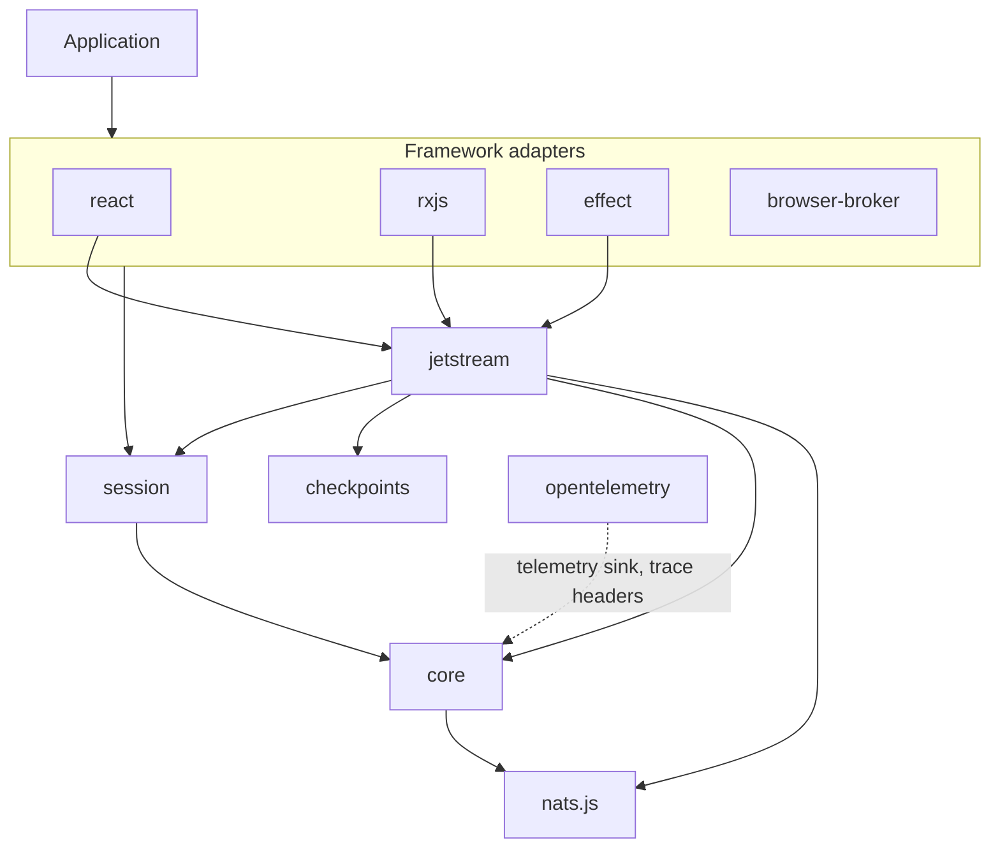

# NATSail architecture

How the packages fit together and who owns what. For delivery guarantees and failure behavior, see the [delivery model](../DELIVERY.md). For deployment tuning, see the [production guide](../PRODUCTION.md). For unfinished work, see [project status](../STATUS.md). For the original problem analysis, see the [research notes](../research/nats-resumable-streams.md).

## Design goals

NATSail wraps nats.js; it does not replace it.

1. One application runtime owns one shared NATS connection.
2. A logical session has one validated delivery contract and any number of local observers.
3. A reducing session never publishes a partly replayed state. Observers see the initial state (`phase: 'replaying'`), then the full history at catch-up.
4. Delivery, buffering, retries, and cleanup each have an owner and a limit.
5. The application keeps its reducers, authorization, and persistence.

## Package layers



Each package declares its internal dependencies in `package.json`. Core imports none of the others.

| Package                   | Owns                                                                                                                                                                  |
| ------------------------- | --------------------------------------------------------------------------------------------------------------------------------------------------------------------- |
| `@natsail/core`           | The connection, Core subscribe/publish/request, codecs, limits, diagnostics, telemetry sink, `NatsailBatchPolicy` and the batcher.                                    |
| `@natsail/jetstream`      | Ordered consumption, replay boundary, cursors, recovery, duplicate and retention policy, reducing sessions, explicit-ack processors and their controller.              |
| `@natsail/session`        | `SessionRegistry`: keyed, reference-counted logical sources, plus `closeNatsResources`.                                                                               |
| `@natsail/checkpoints`    | Monotonic cursor stores: in memory and IndexedDB.                                                                                                                     |
| `@natsail/react`, `@natsail/rxjs`, `@natsail/effect` | Adapters to each framework's lifecycle over the same runtime and session definitions. They add no transport model.                                 |
| `@natsail/browser-broker` | Same-origin tab sharing: a SharedWorker host that runs `SessionSource` leases for many tabs.                                                                          |
| `@natsail/opentelemetry`  | A metrics sink for core's telemetry events, and `injectTraceContext` / `extractTraceContext` for NATS headers. The only package with an OpenTelemetry peer dependency. |

The application owns subject selection and authorization, payload validation, domain reducers, idempotency of external side effects, and any durable materialized view.

## Runtime and connection ownership

`createNatsRuntime()` takes an official nats.js connect function (or `{ create({ signal, attempt, attemptId }) }`) and resolves it lazily into one cached connection.

```ts
const runtime = createNatsRuntime({
  connect: () => connect({ servers }),
  initialConnectRetry: { maxAttempts: 3, delayMs: 500 },
  connectionRecovery: { onPermanentClose: 'restart' }, // or 'wait'
  shutdownTimeoutMs: 30_000,
  maxBufferedEvents: 256,
  limits: { maxJetStreamConsumers: 32, maxBufferedMessages: 2_048 },
})
```

Connection lifecycle:

- nats.js handles ordinary transport reconnects.
- After a permanent close (including nats.js giving up after repeated auth errors), `restart` (the default) immediately runs one connect series under `initialConnectRetry`; `wait` defers it to the next caller. If the series fails, the runtime stays `disconnected` until the next `connection()` call; it does not retry on its own. Put credential refresh in the connect factory.
- Each connection has a generation number, reported by `runtime.inspect().connectionGeneration` and in diagnostic details.
- `runtime.reconnect()` forces re-authentication on a live connection or replaces a closed one. Concurrent callers share one operation.
- `runtime.connection()` returns the runtime-owned nats.js connection for operations NATSail does not wrap. Do not close or drain it.

`runtime.events` is a low-volume stream of status and diagnostic events. Each iterator keeps at most `maxBufferedEvents`; a slow reader loses the oldest and receives an `event-buffer-overflow` diagnostic. `inspect()` returns a point-in-time view: connection, generation, active resources, and used versus configured limits. High-frequency measurements go to the optional `telemetry` sink instead.

### Shutdown

`runtime.close()` drains managed Core subscriptions, lets JetStream processors finish their active handler, then drains the connection. The whole sequence shares `shutdownTimeoutMs`. On expiry the runtime aborts each handler's `signal`, force-closes the connection, and rejects with `NatsRuntimeShutdownTimeoutError`. Cleanup failures reject with `AggregateError`.

A runtime and its session registry have separate lifetimes. `closeNatsResources({ runtime, sessions })` starts both closes at once, and the runtime owns the deadline. React's `NatsManagedProvider` and Effect's `Natsail.layerScoped` call it for you.

### Limits

`limits` caps the aggregate of active JetStream consumers (ordered consumers and processors) and nats.js pull-buffer messages or bytes. A resource reserves its share before it opens and releases it on close. Exceeding a limit throws `NatsRuntimeLimitError`.

Adapter packages join the runtime through the `NATS_RUNTIME_ADAPTER` symbol: `manage()` registers a closable resource with an allocation, and the same reporter carries diagnostics and telemetry.

## Core NATS and JetStream

Core subscriptions are live and ephemeral: presence, token deltas, anything with a separate canonical record.

`consumeJetStream()` is an ordered, unacknowledged consumer whose recovery follows the application's cursor. `processJetStream()` is a named explicit-ack consumer whose recovery follows the server ack floor. Consumer ownership is `bind` (never mutated), `ensure` (editable drift updated) or `owned` (deleted on close, recreated on immutable drift). `createJetStreamProcessorController()` administers the same consumer without a handler loop. Semantics, checkpoints, dispositions, and decode failures: [delivery model](../DELIVERY.md).

Every JetStream delivery carries `headers`. Trace propagation is explicit and lives outside core: `@natsail/opentelemetry` injects and extracts W3C context on NATS headers. Effect service methods and processor deliveries run in spans; each delivery is a root span linked to the producer's `traceparent`.

## Shared logical sessions

A `SessionRegistry` turns a `SessionDefinition` (`key`, `contract`, `source`) into one local source with reference counting. Each observer calls `acquire()` and `release()`; observers of one definition share the source, so several React selectors or RxJS subscriptions open one consumer. `restart(key)` reopens the source and keeps the shared handle and latest value.

Sharing requires the key and the serialized `contract` to match. The contract serializes stream, filters, start, buffer, duplicate and retention policy, resume key and scope, and recovery settings. Reducing sessions add the reducer scope, batch bounds and work budget. The codec and reducer functions are not compared: version them with `resume.scope` or `reducer.scope`. Reusing a key with a different contract throws `SessionContractMismatchError`. Custom `recovery.delayMs` or `shouldRetry` functions need a stable `recovery.scope`.

`idleCloseMs` (default 0: close at once) delays closing an unreferenced source; a few hundred ms lets a React Strict Mode remount reuse it instead of reopening the consumer.

NATSail keeps one consumer per independently resumable feed and bounds the total with `limits`.

Sharing works across adapters for definition-based APIs. Effect's `jetStreamEvents`, `jetStreamDeliveries`, `materializeJetStream` and `subscribe` open one consumer per Stream run.

## Atomic replay and UI materialization

`defineReducingJetStreamSession()` folds ordered deliveries into application state. It publishes `reducer.initial()` once as `replaying`, reduces the backlog without publishing, then publishes the full history once at catch-up as `live`. After that, each live batch publishes one reduced state. A history view therefore never renders a half-built transcript. Snapshots report `phase` (`replaying`, `reconnecting`, `live`), the last cursor, replay counts, and package restarts.

### Batching

`NatsailBatchPolicy<T>` (core) is the one bounding vocabulary: `maxItems`, `maxBytes` (with `sizeOf`), `maxWaitMs`; at least one is required. A batch flushes at `maxItems`, before an item would exceed `maxBytes`, or `maxWaitMs` after its first item; one item larger than `maxBytes` fails with `NatsailBatchItemTooLargeError`. Completion flushes the partial batch and cancellation discards it; an applying batch always finishes.

Reducing sessions accept `batchPolicy`, `liveBatchMs` (16 ms default, `0` disables the time window), `scheduler`, and `workBudget`. Replay applies in bounded batches, one at a time, with serial reducer calls; the cursor or checkpoint advances only after a batch applies. `workBudget: { yieldAfterMs, scheduler }` makes the reducer loop yield after each slice; use `natsailDefaultScheduler` for host timers.

Each adapter applies the same policy in its own idiom:

- React: `notifications: 'immediate' | 'microtask' | 'animation-frame'` plus `batchPolicy` on the reducer hooks.
- RxJS: `observeNatsJetStreamState()` with `liveBatchMs` or `batchPolicy`, and the generic `batchWithPolicy(policy)` operator.
- Effect: `materializeJetStream()` reduces its own consumer in bounded batches (`batchPolicy`, `workBudget`). `jetStreamStates()` coalesces a shared reducing definition (`liveBatchWithin`).

Batching limits application and rendering work. It does not make an unbounded reducer bounded or replace list virtualization.

## Backpressure and bounded resources

Runtime limits, pull buffers, processor windows, and Effect queues each bound a different resource. See [Resource limits and buffering](../DELIVERY.md#resource-limits-and-buffering).

## Recovery model

The narrowest owner handles each failure:

1. nats.js reconnects an interrupted transport.
2. The runtime replaces a permanently closed connection.
3. A session with `recovery` reopens a failed ordered consumer after its last accepted in-memory cursor.
4. A checkpointed new lease resumes after its durable cursor.
5. A reducing session with no persisted state rebuilds from retained history.
6. A recovering processor resumes from the server acknowledgement floor.

Leases opened on a closed connection do not move to its replacement. Core subscriptions and JetStream leases without `recovery` close. Leases with `recovery` reopen on the new connection. Reducing sessions always have `recovery` (unlimited attempts, 1 s delay).

Reducing sessions reject `resume`, because a cursor without its matching state skips events.

## Framework ownership

- `@natsail/react`: `NatsManagedProvider` creates the runtime and registry after commit, reuses them across Strict Mode effect replay, and closes both through `closeNatsResources` after the final unmount. A changed `identity` replaces the resource. `NatsProvider` accepts caller-owned objects.
- `@natsail/rxjs`: Observables are cold and cancellable. Each subscription acquires a handle and unsubscription releases it.
- `@natsail/effect`: `Natsail.layer(resource)` supplies caller-owned objects; `Natsail.layerScoped(acquire)` closes registry and runtime when the Layer scope exits. Streams are scope-bound, errors are typed by stage, and interruption aborts the underlying NATS request or processor handler.

## Deployment topologies

Direct browser WebSocket and Node.js transports work through official nats.js connect functions. One runtime shares one connection per JavaScript realm.

Browser tabs are separate realms. `@natsail/browser-broker` runs sources in a SharedWorker so tabs with the same identity, key, and contract share one physical source; a tab that lags receives `resume-required` instead of losing items, and publish/request go through named operations that the worker maps to authorized subjects. See its [guide](../../packages/browser-broker/README.md).

The Cloudflare Durable Object gateway under `prototypes/` and `examples/gateway-chat` is a prototype. Authentication, backpressure, eviction, remote deployment, and cost policy are unproven.

## Current boundary

NATSail does not provide:

- a domain event store or reconciliation with a database
- authorization from user input to subjects
- exactly-once external side effects
- a reducer snapshot plus cursor store
- a production Durable Object gateway
- list virtualization or domain-specific ordering in a UI

See [status](../STATUS.md) for the proofs still needed.
